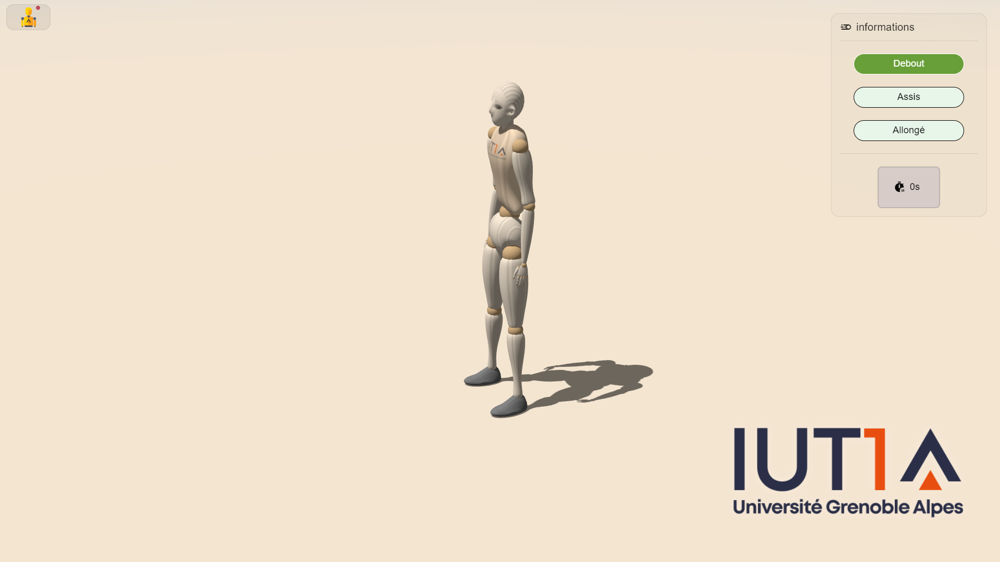
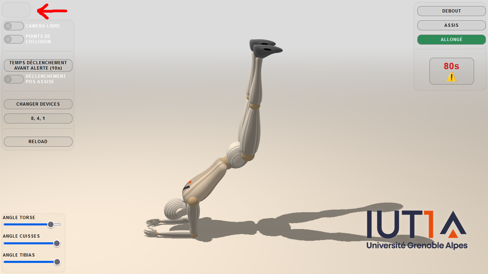

# Posture tracking

This project was carried out as part of a work-study project at IUT 1 in Grenoble.

It is a web application designed to track and analyze a user's posture using remote sensors. The application uses Three.js for 3D visualization, and is packaged in an Electron application for porting to Windows.

This project was carried out within the scope of the FAME project (Formation et attractivité des métiers de l'électronique) supported by the [UGA](https://www.univ-grenoble-alpes.fr/) as part of a demonstrator showcasing electronics and embedded systems projects. Indeed, the second part of the project is the realization of sensors in embedded systems using STM32 and the LoRaWAN communication protocol. This second part is the "business skills" part that GEII students are developing as part of their training.

## Features 🛫

- Real-time animation of a 3D dummy based on sensor data.
- Tracking of torso, thigh and shin position/posture.
- Intuitive user interface for viewing posture data.

## System requirements 💻

🚧🚧🚧🚧🚧🚧🚧 *Under construction*
Since the server cannot be accessed remotely, I've created an end point at `ws://endPoint.iut1-posture.raserber.fr:8001`. You can therefore replace `ws://192.168.1.20:1880` with this end point.
🚧🚧🚧🚧🚧🚧🚧

## Installation ⬇️

1. go to "Releases"
2. Download the latest
3. run the .exe

For devs :
1. Clone this repository on your machine.
3. Run `npm install` to install the dependencies.
4. Launch the application by running `npm start`.

## Usage

1. Launch the application.
3. Select the sensors to be used in the interface. *(8, 4, 1 for the endpoint 🚧🚧)*
4. View the 3D mannequin's posture in real time.

> The square at top left is a button opening a configuration menu.

## Acknowledgements

- [MannequinJS by Boytchev](https://github.com/boytchev/mannequin.js)
- [SweetAlert by t4t5](https://github.com/t4t5/sweetalert)
- <a href="https://www.flaticon.com/fr/icones-gratuites/mannequin" title="mannequin icônes">Mannequin icônes créées par Flat Icons - Flaticon</a>
## License

This project is licensed under [insert license here]. See the LICENSE file for details.