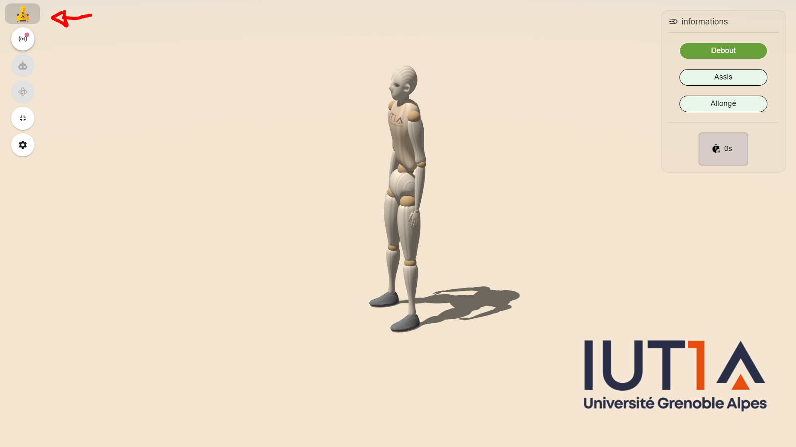

# Posture Tracking

This project was developed as part of a work-study program at IUT 1 in Grenoble during my internship.


It is a web application designed to track and analyze a user's posture using remote sensors. The application uses [Three.js](https://threejs.org/) ([MannequinJS by Boytchev](https://github.com/boytchev/mannequin.js)) for 3D visualization and is packaged in an Electron application for deployment on Windows.

This project was carried out within the scope of the [FAME project](https://iut1.univ-grenoble-alpes.fr/actualites/projet-fame-un-boost-pour-les-metiers-de-l-electronique-a-l-iut1--1439817.kjsp) (Formation et attractivité des métiers de l'électronique), supported by the [UGA](https://www.univ-grenoble-alpes.fr/), as part of a demonstrator showcasing electronics and embedded systems projects. The second part of the project involves creating sensors for embedded systems using STM32 and the LoRaWAN communication protocol. This aspect focuses on the "business skills" GEII students develop during their training.


## Features 🛫

- Acquire sensor data from any device that can communicate with an MQTT Broker.
- Track position/posture with 1 to 3 sensors placed on the torso, thigh, and/or shin.
- Real-time animation of a 3D dummy based on sensor data.
- Intuitive user interface for viewing posture data.

## System Requirements 💻

To install the `.exe`, you must have a Windows system with x64/x86 architecture.

## Installation ⬇️

1. Go to "Releases."
2. Download the latest version.
3. Run the `.exe`.

For developers:

1. Clone this repository to your machine.
2. Run `npm install` to install the dependencies (the `MannequinJS` dependency is included directly in the `src` folder).
3. Launch the application by running `npm start`.

## Usage

1. Launch the application.
2. Select the MQTT Broker you want to use (can be local).
3. Select the sensors to be used in the interface.
4. View the 3D mannequin's posture in real time.

### MQTT Message Requirements:

The MQTT messages must:

- Be in JSON format.
- Contain the following mandatory fields:

```json
{
    "accX": [Double](g),
    "accY": [Double](g),
    "accZ": [Double](g),
    "gyrX": [Double](deg/s),
    "gyrY": [Double](deg/s),
    "gyrZ": [Double](deg/s)
    // These values are used in the
    // data fusion algorithm to calculate
    // angleX, angleY, and angleZ.
}

```
- And recommended :

```JSON
{
    "deviceName": [String], // The name to be displayed
    "dt": [Number](ms)  // Delta time between each measurement
    "conversionAcc" : [Double] // optionnal, permit to convert from raw data : acc = raw_acc/conversionAcc
    "conversionGyr" : [Double] // gyr = raw_gyr/conversionGyr
}
```
*The delta time should be less than 2000ms for good results. If it is not specified the default value is 100ms. It's strongly recommended to set this in your MQTT message.*


> The square at top left is a button opening a configuration menu.


Top to bottom : 
1. Connection to an MQTT broker
2. Change subscribed devices
3. Change angles assigned to subscribed devices
4. Toggle fullscreen
5. Open settings

## Acknowledgements

- [MannequinJS by Boytchev](https://github.com/boytchev/mannequin.js)
- [SweetAlert2](https://github.com/sweetalert2/sweetalert2)
- <a href="https://www.flaticon.com/fr/icones-gratuites/mannequin" title="mannequin icônes">Mannequin icônes créées par Flat Icons - Flaticon</a>
## License

This project is licensed under [insert license here]. See the LICENSE file for details.